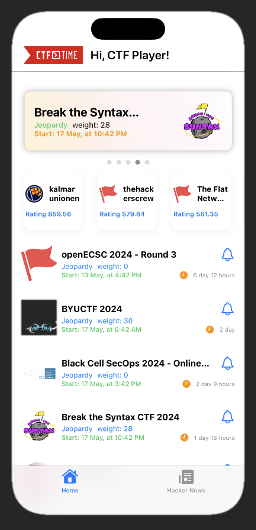

# CTF Time Application

<center>

</center>

## Overview

The CTF Time Application is a comprehensive tool designed to manage and participate in Capture The Flag (CTF) competitions.

## Features

- Event Tracking: Stay updated with the latest CTF events, including start times, end times, and detailed descriptions.
- Notifications: Get real-time updates and notifications about important events and changes.

### Installation

```bash
 git clone https://github.com/nutthanonn/ctftime-mobile-application.git
 cd ctftime-mobile-application
```
